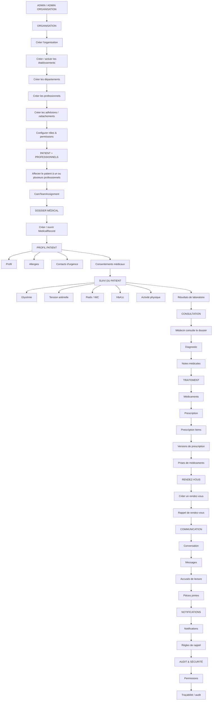

# DiabCare — Carte de progression métier

> **Objectif :** suivre l'ordre logique d'utilisation de l'API, depuis la mise en place de l'organisation jusqu'au suivi quotidien du patient.

---

## 🗺 Vue d'ensemble



---

# 1.  Mise en place de l'organisation

### Acteur principal
**Admin / Admin d'organisation**

### Objectif

Créer l'environnement dans lequel les patients et les professionnels vont travailler.

### Ordre

```text
Organisation
    ↓
Établissement
    ↓
Département
    ↓
Professionnels
    ↓
Adhésions / rattachements
    ↓
Rôles & permissions
```

### APIs concernées

```text
Healthcare - Organizations
    POST /api/healthcare-organizations
    GET  /api/healthcare-organizations/{id}
    PUT  /api/healthcare-organizations/{id}

Healthcare - Facilities
    POST /api/healthcare-facilities
    GET  /api/healthcare-facilities/organization/{organizationId}

Healthcare - Departments
    POST /api/departments
    GET  /api/departments/facility/{facilityId}

Identity - Professionals
    POST /api/professionals
    GET  /api/professionals

Organization Memberships
    POST /api/organization-memberships

User Roles
    POST /api/users/{id}/roles
```

### Résultat attendu

À la fin de cette étape :

```text
Organisation
   ├── Établissements
   │      └── Départements
   │
   ├── Professionnels
   │
   └── Utilisateurs avec leurs rôles
```

---

# 2.  Affecter le patient aux professionnels

### Acteur principal

**Admin d'organisation**

### Objectif

Déterminer quels professionnels suivent quel patient.

```text
Patient
   │
   ├──────────→ Médecin
   │
   ├──────────→ Nutritionniste
   │
   └──────────→ Autre professionnel
```

### API

```text
POST /api/healthcare-organizations/{organizationId}/care-team-assignments
```

### Résultat

```text
Patient
   │
   └── CareTeamAssignment
          ├── Organisation
          ├── Patient
          └── Professionnel
```

### Point de sécurité important

Cette affectation ne sert pas uniquement à savoir qui suit le patient.

Elle peut également servir à contrôler :

```text
Médecin connecté
      ↓
Est-il affecté à ce patient ?
      ↓
    ┌───────┐
    │       │
   OUI     NON
    │       │
    ↓       ↓
 Autorisé   403
```

---

# 3.  Créer le dossier médical

### Acteur

**Organisation / professionnel autorisé**

### API

```text
POST /api/medical-records
```

### Parcours

```text
Patient
   ↓
Affectation à un professionnel
   ↓
MedicalRecord
   ↓
Dossier médical ouvert
```

Le dossier devient ensuite le point central des informations médicales du patient.

```text
MedicalRecord
   ├── Diagnostics
   ├── Notes médicales
   ├── Mesures
   ├── Résultats
   └── Traitements
```

> **Important :** le backend doit vérifier que l'utilisateur connecté est autorisé à créer ou modifier le dossier du patient.

---

# 4.  Compléter le profil du patient

### Acteur principal

**Patient**

### APIs

```text
PUT /api/patients/{id}/profile
PATCH /api/patients/{id}/profile

POST /api/allergies
POST /api/emergency-contacts
POST /api/medical-consents
```

### Parcours

```text
Patient
   │
   ├── Profil
   ├── Allergies
   ├── Contacts d'urgence
   └── Consentements médicaux
```

Cette étape permet au professionnel de disposer des informations de base nécessaires au suivi.

---

# 5.  Enregistrer les mesures du patient

### Acteur principal

**Patient**

Le patient commence alors son suivi quotidien.

### APIs

```text
POST /api/patients/{patientId}/blood-glucose-measurements
POST /api/patients/{patientId}/blood-pressure-measurements
POST /api/patients/{patientId}/weight-measurements
POST /api/patients/{patientId}/hba1c-measurements
POST /api/patients/{patientId}/physical-activity-measurements
POST /api/patients/{patientId}/laboratory-results
```

### Parcours

```text
                    PATIENT
                       │
        ┌──────────────┼──────────────┐
        ↓              ↓              ↓
    Glycémie        Tension       Poids / IMC
        │              │              │
        └──────────────┼──────────────┘
                       │
             ┌─────────┼─────────┐
             ↓         ↓         ↓
           HbA1c    Activité   Laboratoire
```

### Principe de sécurité

Le patient connecté ne devrait pas pouvoir déclarer qu'une mesure a été enregistrée par un autre utilisateur.

Le backend doit déterminer l'utilisateur à partir du JWT :

```text
JWT
 ↓
Utilisateur connecté
 ↓
Patient
 ↓
Mesure
 ↓
recordedBy
```

---

# 6.  Consultation médicale

### Acteur principal

**Médecin / professionnel autorisé**

Le médecin consulte les informations accumulées par le patient.

```text
Patient
   │
   ├── Profil
   ├── MedicalRecord
   ├── Glycémie
   ├── Tension
   ├── Poids
   ├── HbA1c
   ├── Activité
   └── Laboratoire
             │
             ↓
        MÉDECIN
```

Le médecin peut ensuite produire de nouvelles informations médicales.

### APIs

```text
POST /api/diagnoses
POST /api/medical-notes
```

### Parcours

```text
Mesures du patient
       ↓
Consultation du médecin
       ↓
Diagnostic
       ↓
Notes médicales
```

### Règle métier essentielle

Un médecin ne doit pas pouvoir créer un diagnostic pour n'importe quel patient.

Le service doit vérifier :

```text
Médecin connecté
      ↓
CareTeamAssignment
      ↓
Suit-il ce patient ?
      ↓
 ┌────┴────┐
 OUI       NON
  ↓         ↓
Autorisé    403
```

---

# 7.  Traitement

Après le diagnostic, le professionnel peut mettre en place le traitement.

### APIs

```text
POST /api/medications
POST /api/prescriptions
POST /api/prescription-items
POST /api/prescription-versions
POST /api/medication-intakes
```

### Parcours

```text
Diagnostic
    ↓
Prescription
    ↓
Prescription Items
    ↓
Médicaments
    ↓
Patient
    ↓
Medication Intake
```

### Vue métier

```text
️ Médecin
     │
     ↓
Prescription
     │
     ├── Médicament A
     ├── Médicament B
     └── Médicament C
             │
             ↓
           Patient
             │
             ↓
      Enregistre ses prises
```

---

# 8. Rendez-vous

Une fois le suivi médical fonctionnel, le rendez-vous devient une interaction naturelle entre patient et professionnel.

### API

```text
POST /api/appointments
```

### Parcours

```text
Patient
   ↓
Rendez-vous
   ↓
Professionnel
   ↓
Organisation
   ↓
Établissement
   ↓
Date / heure
```

Puis :

```text
POST /api/appointment-reminders
```

pour programmer les rappels.

---

# 9.  Communication

Lorsque le patient et le professionnel sont correctement liés, ils peuvent communiquer.

### APIs

```text
POST /api/conversations
POST /api/messages
POST /api/message-read-receipts
POST /api/message-attachments
POST /api/file-attachments
```

### Parcours

```text
Patient
   │
   ▼
Conversation
   │
   ├── Message
   ├── Message
   ├── Pièce jointe
   └── Accusé de lecture
   │
   ▼
Médecin
```

---

# 10.  Notifications

Les notifications peuvent ensuite informer les utilisateurs des événements importants.

### APIs

```text
POST /api/notifications
POST /api/reminder-rules
```

Exemples :

```text
Rendez-vous demain
       ↓
Notification

Médicament à prendre
       ↓
Notification

Rappel de mesure
       ↓
Notification
```

---

# 11.  Sécurité et audit

Cette étape doit fonctionner **en parallèle de toutes les précédentes**, et pas seulement à la fin.

À contrôler systématiquement :

```text
JWT
 ↓
Utilisateur connecté
 ↓
Rôle
 ↓
Organisation
 ↓
CareTeamAssignment
 ↓
Permission
 ↓
Action
```

Exemple :

```text
Médecin A
   ↓
Veut consulter Patient X
   ↓
Même organisation ?
   ↓
Patient X lui est affecté ?
   ↓
Permission suffisante ?
   ↓
      OUI
       ↓
   Autoriser
```

Sinon :

```text
403 Forbidden
```

---

#  ORDRE FINAL DE DÉVELOPPEMENT

Si tu viens **juste de terminer `CareTeamAssignment`**, suis maintenant cet ordre :

```text
┌──────────────────────────────────────┐
│ 01 │ MedicalRecord                   │
└──────────────────┬───────────────────┘
                   ↓
┌──────────────────────────────────────┐
│ 02 │ Profil patient                  │
│    │ Allergies                       │
│    │ Contacts d'urgence              │
│    │ Consentements                    │
└──────────────────┬───────────────────┘
                   ↓
┌──────────────────────────────────────┐
│ 03 │ Mesures patient                 │
│    │ Glycémie                        │
│    │ Tension                         │
│    │ Poids / IMC                     │
│    │ HbA1c                           │
│    │ Activité                        │
│    │ Laboratoire                     │
└──────────────────┬───────────────────┘
                   ↓
┌──────────────────────────────────────┐
│ 04 │ Consultation médicale           │
│    │ Diagnostic                      │
│    │ Notes médicales                 │
└──────────────────┬───────────────────┘
                   ↓
┌──────────────────────────────────────┐
│ 05 │ Traitement                      │
│    │ Médicaments                     │
│    │ Prescriptions                   │
│    │ Prises de médicaments           │
└──────────────────┬───────────────────┘
                   ↓
┌──────────────────────────────────────┐
│ 06 │ Rendez-vous                     │
│    │ Appointment                     │
│    │ Appointment Reminder             │
└──────────────────┬───────────────────┘
                   ↓
┌──────────────────────────────────────┐
│ 07 │ Communication                   │
│    │ Conversations                   │
│    │ Messages                        │
│    │ Pièces jointes                  │
│    │ Accusés de lecture              │
└──────────────────┬───────────────────┘
                   ↓
┌──────────────────────────────────────┐
│ 08 │ Notifications                   │
│    │ Notifications                   │
│    │ Reminder Rules                  │
└──────────────────┬───────────────────┘
                   ↓
┌──────────────────────────────────────┐
│ 09 │ Audit / sécurité / durcissement │
└──────────────────────────────────────┘
```

---

#  TON PROCHAIN OBJECTIF

Tu es actuellement ici :

```text
Organisation
    ↓
Professionnels
    ↓
Patient
    ↓
CareTeamAssignment
    │
    │  ← TU ES ICI
    ↓
┌───────────────────────┐
│  MedicalRecord        │
│  ← PROCHAINE ÉTAPE    │
└───────────────────────┘
    ↓
Profil patient
    ↓
Mesures
    ↓
Diagnostic
    ↓
Traitement
    ↓
Rendez-vous
    ↓
Communication
    ↓
Notifications
```

**Donc ne pars pas directement sur `Appointments`.**  
La prochaine étape métier cohérente est **`MedicalRecord`**, puis les informations de base du patient, puis ses mesures. Une fois ces éléments disponibles, le médecin peut réellement commencer son travail clinique.
